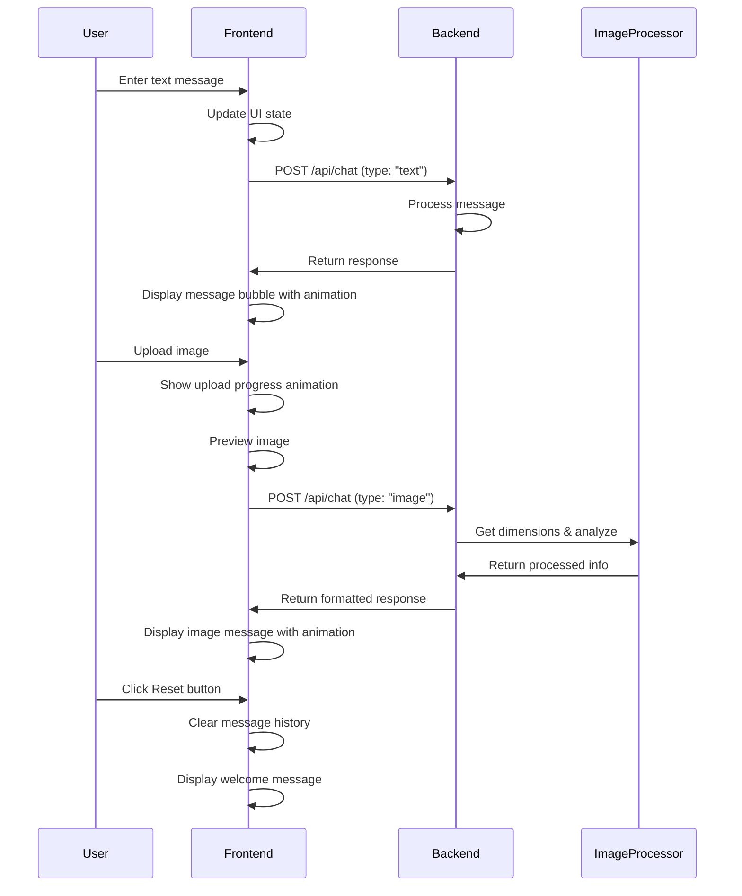
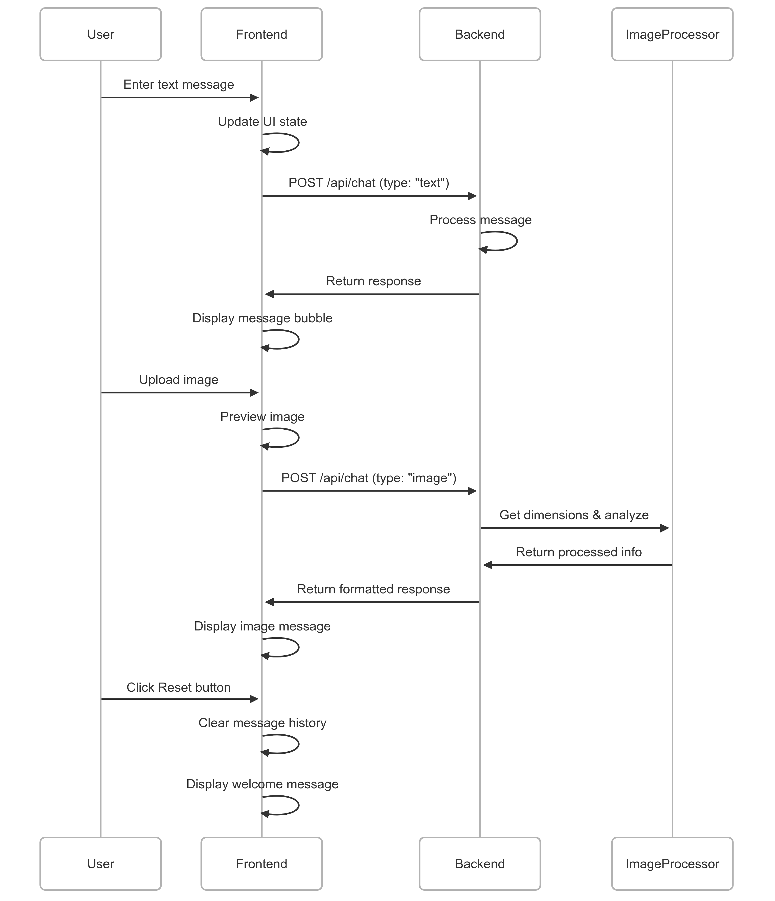

# Project Architecture and Setup

## Architecture Overview

This full-stack chat application consists of a React frontend and Python backend with real-time message processing capabilities.

### Frontend

- **Framework**: Next.js with React and TypeScript
- **UI**: shadcn/ui components with Tailwind CSS styling
- **State Management**: React Query for API interactions
- **Animations**: Framer Motion for smooth transitions and feedback
- **Testing**: Jest and React Testing Library

### Backend

- **Framework**: FastAPI
- **Services**:
  - Response Service: Generates text/file/image responses
  - Image Processor: Handles image dimension detection

### Key Features

- Text messaging interface
- File/image upload and processing
- Animated UI elements
- Responsive message bubbles
- Chat history management

## Local Development

### Prerequisites

- Node.js 20+ and npm
- Python 3.11+
- pip

### Frontend Commands

```bash
# Navigate to frontend directory
cd frontend

# Install dependencies
npm install

# Start development server
npm run dev

# Run tests
npm test

# Build for production
npm run build
```

### Backend Commands

```bash
# Navigate to backend directory
cd backend

# Create virtual environment (recommended)
python -m venv venv
source venv/bin/activate  # On Windows: venv\Scripts\activate

# Install dependencies
pip install -r requirements.txt

# Start development server
uvicorn main:app --reload

# Run tests
pytest
```

## Docker Setup

For containerized development and deployment:

```bash
# Build and start all services
docker-compose up --build

# Run in background
docker-compose up -d

# Stop all services
docker-compose down
```

## Message Flow Diagram





## Data Flow

1. **User Input**: Text messages or file uploads from the UI
2. **Frontend Processing**: Local state updates and optimistic UI changes
3. **API Communication**: Requests to backend endpoints with appropriate payloads
4. **Backend Processing**: Message/file analysis and response generation
5. **Response Rendering**: Animated display of responses with appropriate formatting
